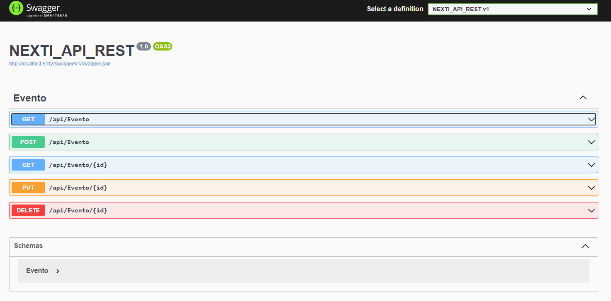

# API REST EVENTOS 
La empresa NEXTI te encarga la construcción de un aplicativo para la venta de entradas para acontecimientos deportivos y culturales. Se quiere que la aplicación funcione en la web, de tal manera que los usuarios accedan a través de un navegador. 

Los usuarios podrán registrar, eliminar, modificar, consultar un evento y consultar todos los eventos.Las características del evento son: 

Fecha evento
Lugar evento
Descripción del evento 
Precio
La eliminación del evento debe ser lógica a nivel de BDD. 

### Configuración del proyecto
Ahora toca configurar la conexion a nuestra *base de datos*:
```
"Connection": "Server=.\\SQLExpress02;Database=EventoDB;Trusted_Connection=true;TrustServerCertificate=true"
```
Recuerda colocar tu cadena de conexion a tu base de datos, en este caso **SQLExpress02** es el nombre del servidor y **EventoDB** es la base de datos.

### Comandos:
###### Package Management Console: Herramientas > Administrador de paquetes Nuget > Consola.
Para hacer una migración y crear tu tabla en sql server:

```
Add-Migration Inicial
```  
Toma las migraciones pendientes y lo empuja a la BD. Si la BD no existe, lo crea.

```
Update-Database
 ``` 

Mismos comandos con Dotnet CLI:
```
dotnet ef migrations add Inicial
```

Toma las migraciones pendientes y lo empuja a la BD. Si la BD no existe, lo crea.

```
dotnet ef database update
```

Ejecuta el proyecto
```
dotnet run --project NEXTI_API_REST.csproj
```

### Metodos HTTP

- Los métodos HTTP, son un mecanismo del protocolo HTTP los cuales nos permiten expresar una acción que queremos ejercer sobre el recurso. Estos métodos son:
  - GET: Este se utiliza para pedir datos del servidor.
  - POST: Sirve para indicar que queremos enviar información al servidor, tipicamente a través del cuerpo de la petición HTTP. El uso común que se le da al post es insertar la información enviada al web API en una base de datos.
  - PUT: Normalmente utilizamos put casi de la misma manera que post, con la diferencia de que put tambien sirve para actualizar un recurso existente en la base de datos.
  - DELETE: Sirve para expresar que queremos borrar un recurso determinado.

  

